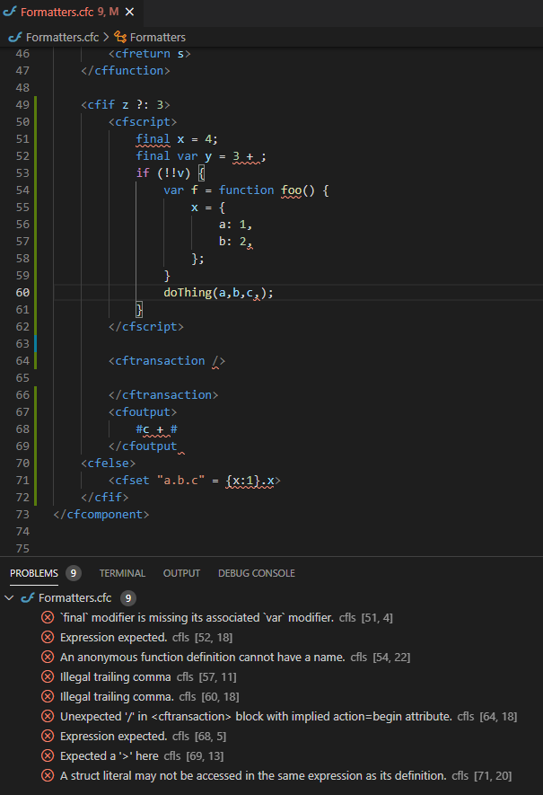

## cflsp - A ColdFusion Language Plugin

This is an experiment in writing a parser to see what kind of diagnostics can be had for ColdFusion2018+. It helps me in my day-to-day in a very minimal way, mostly by pointing out illegal trailing commas in function calls and struct literals.

I really recommend [KamasamaK's current plugin](https://github.com/KamasamaK/vscode-cfml) as the current best CF plugin; this is intended to work on top of that (note there is ZERO affiliation between this plugin and the KamasamaK one) as the other provides nice completions and syntax highlighting. This one just squiggle-underlines syntactic errors.

Thanks for having a look. If you install it and it gives you problems, give me a shout [on github](https://github.com/softwareCobbler/cfc).

